<p align="center">
  
</p>

<h1 align="center">PuriPuly <3</h1>

<p align="center">
  
  
  
  
</p>

<p align="center">VRChatのためのLLMベース リアルタイム翻訳ツール</p>

<p align="center">
  <a href="README.md">English</a> | <a href="README.ko.md">한국어</a> | <b>日本語</b> | <a href="README.zh-CN.md">简体中文</a>
</p>

---

## Demo


---

<video src="https://github.com/user-attachments/assets/9462c231-d788-440c-b3c5-9426448e0de8" controls width="100%"></video>

<video src="https://github.com/user-attachments/assets/5555753b-d09a-4f7a-ad4f-9c150d90d150" controls width="100%"></video>

---

## Finally, talk like real friends.

慰めたかったのに、  
「大丈夫？」としか声がかけられなかったこと、ありますよね。

伝えたい気持ちが、  
ただの「翻訳機」じゃ届かないこと、わかってますよね。

だから、作ったんです。

- **LLMベースのローカライズ** — スラングや話し言葉、タメ口や敬語まで自然に
- **文脈の記憶** — 前後の脈絡を考慮し、自然な会話の流れを維持
- **荒い入力でもOK** — スペースが間違っていたり、文字が途切れていても復元可能
- **「私らしい」言葉で翻訳** — プロンプトエディタでスタイルを自由に指定

### [📥 ダウンロード](https://github.com/kapitalismho/PuriPuly-heart/releases/latest)

---

## 使うのにお金はかかりますか？

新規登録時（Deepgram、Google AI Studio）に提供される無料クレジットを利用することで、**約25万回まで無料**で使用できます。

無料クレジットを使い切った後は、発話1回ごとに少額の料金が発生します。

このアプリはクラウドAIサービスを活用しています。ユーザー自身が取得したAPIキーを使って、使用した分だけ直接課金される仕組みです。

---

### おすすめの組み合わせ：Deepgram + Gemini（高速応答）

| Status | Cost/Utterance |
|--------|----------------|
| 無料クレジット使用時 | **$0.00** |
| クレジット消費後 | ~$0.0015 (約0.23円) |

* Deepgramは$200、Geminiは$300の無料クレジットを提供しています。
---

### 発話ごとのコスト

| Combo | Full price | Deepgram Free Credit | Gemini Free Credit | Both Free Credits |
| :--- | :--- | :--- | :--- | :--- |
| **Deepgram + Gemini 3 Flash** | ~$0.0015 (約0.23円) | ~$0.0007 (約0.11円) | ~$0.0008 (約0.12円) | $0.00 |
| **Soniox + Gemini 3 Flash** | ~$0.0013 (約0.20円) | - | ~$0.0006 (約0.09円) | - |
| **Qwen ASR + Qwen 3.5 Plus** | ~$0.0006 (約0.09円) | - | - | $0.00 |
| **Qwen ASR + Qwen 3.5 Flash** | ~$0.0005 (約0.08円) | - | - | $0.00 |

*   *QwenのAPIコストは北京リージョン基準*
*   *Sonioxは接続時間ごとの課金が発生します*
*   *（入力 850トークン + 出力 20トークン）× 発話1回あたりの平均LLM呼び出し回数 1.3回と仮定*
*   *料金表基準：2026年3月2日 / 高速応答モード有効時*
*   *1ドル = 150円*

---

### 無料クレジット

| サービス | 無料クレジット | 期限 | 備考 |
|--------|------------|------|------|
| **Deepgram** | $200 | なし | - |
| **Gemini** | $300 | 90日 | 有料プランへ移行後に付与 |
| **Qwen** | モデルごと100万トークン | 90日 | シンガポールリージョン基準 |

---

# APIキーに馴染みがない場合は、[ガイド](#apiキー発行ガイド)を見ながら進めてください

## 使い方

1. [ダウンロードページ](https://github.com/kapitalismho/PuriPuly-heart/releases/latest)から最新バージョンをダウンロードしてインストール
2. [Deepgram](https://console.deepgram.com)でDeepgram APIキーを発行
3. [Google AI Studio](https://aistudio.google.com/apikey)でGemini APIキーを発行
4. **Gemini APIの支払いプラン**を有料プランに切り替え（強く推奨）
  - 無料枠は、実用が困難なほど1分あたりの呼び出し制限が厳しく設定されています。
5. PuriPulyの **Settings** タブにAPIキーを入力して検証
  - 入力欄にAPIキーを貼り付けた後、Enterキーを押すか、フォーカスを外してください。
6. **Dashboard** で元の言語/対象の言語を選択
7. **STT**と**Trans**ボタンをクリック
8. VRChatでOSCを有効化：Settings → OSC → Enable

* 音声が認識されない場合は、PuriPulyの設定タブで正しいマイクを選択してください。

---

### 中国のユーザーへ向けた案内

Gemini / Deepgram / Sonioxへのアクセスがブロックされている地域の場合

1. [Alibaba Cloud Model Studio](https://bailian.console.alibabacloud.com)でAPIキーを発行（北京リージョン）
2. **Settings** でプロバイダーを変更：
   - STT: **Qwen ASR**
   - LLM: **Qwen 3.5 Plus**
   - Qwenサーバーリージョン: **Beijing**
3. Qwen APIキー（Beijing）を入力して検証

---

## APIキー発行ガイド

<details>
<summary><h3>Deepgram</h3></summary>

1. [Deepgram Console](https://console.deepgram.com/)にアクセスしてログインします。
   

2. 歓迎メッセージとアンケートが表示されたら、**Skip** を押してスキップします。
   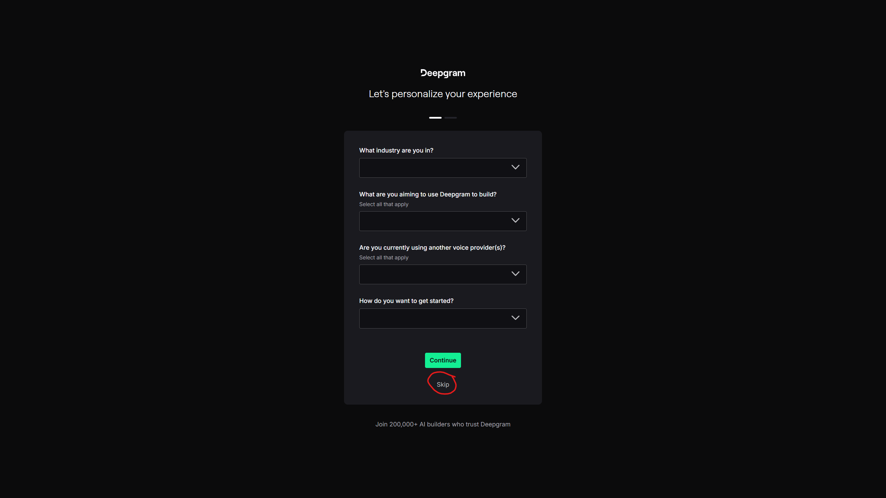

3. サービス選択画面で **STT (Speech-to-Text)** を選択します。
   

4. API Keysメニューで **Create a New API Key** をクリックします。
   

5. キーの名前を入力し（例：`puripuly`）、作成します。
   

6. 作成されたキーをコピーして、PuriPulyの設定に貼り付けます。
   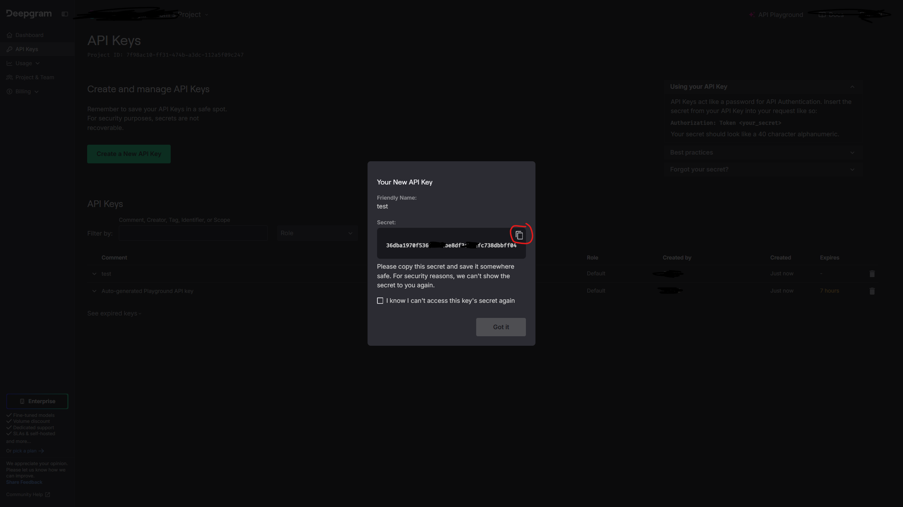

</details>

<details>
<summary><h3>Gemini</h3></summary>

1. [Google AI Studio](https://aistudio.google.com/apikey)にアクセスし、**Get API key** ボタンをクリックします。
   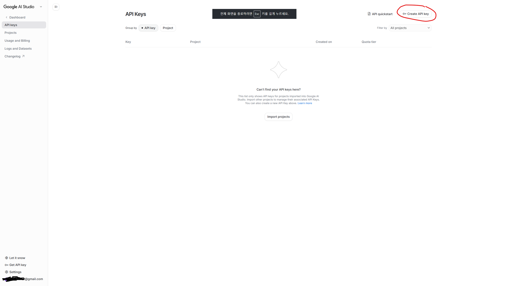

2. 新しいプロジェクトを作成します。
   

3. 任意の名前を付けます。
   

4. 作成したプロジェクトを選択し、**Create key** を押します。
   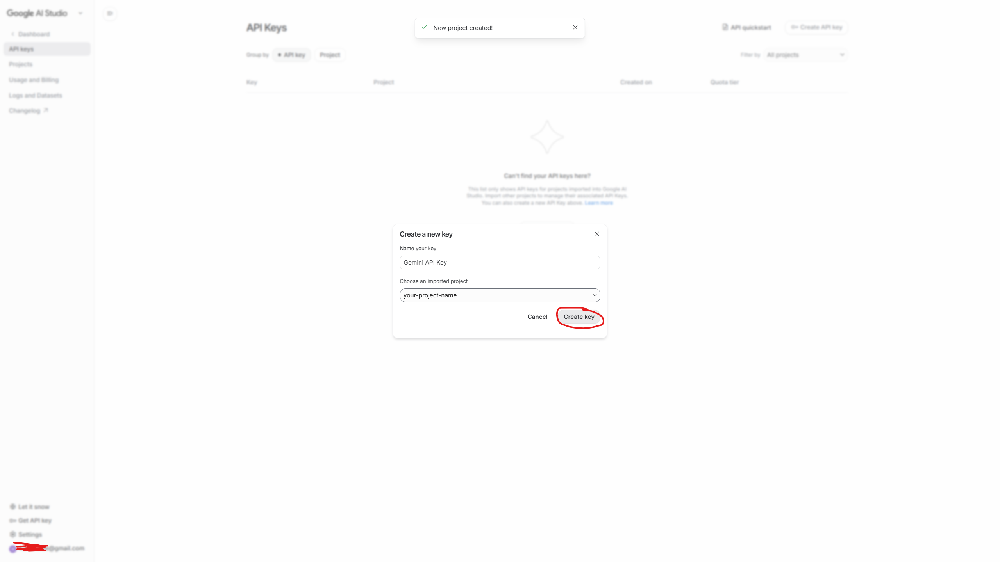

5. 丸で囲まれた部分を押します。
   

6. 丸で囲まれた部分を押してキーをコピーします。
   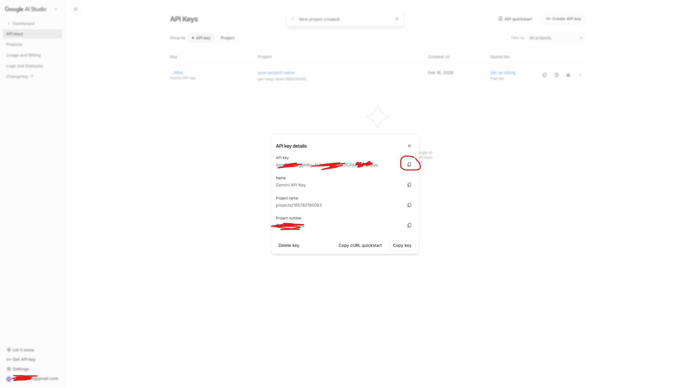

7. （強く推奨）黄色で強調表示されている **Set Up Billing** ボタンを押し、有料プランへ移行します。
   

</details>

<details>
<summary><h3>Qwen</h3></summary>

1 地域に合った経路でAlibaba Cloud Model Studioにアクセスします。
   - [中国本土](https://bailian.console.aliyun.com/cn-beijing)
   - [中国本土以外の地域](https://bailian.console.alibabacloud.com)

2. アクセスしたアドレスからログインします。APIキーを発行したいリージョン（Region）を正確に選択してください（例：Beijing）。
   

3. 右上の **歯車アイコン** をクリックします。
   

4. ワークスペースを作成し、**API-KEY** ページに移動します。
   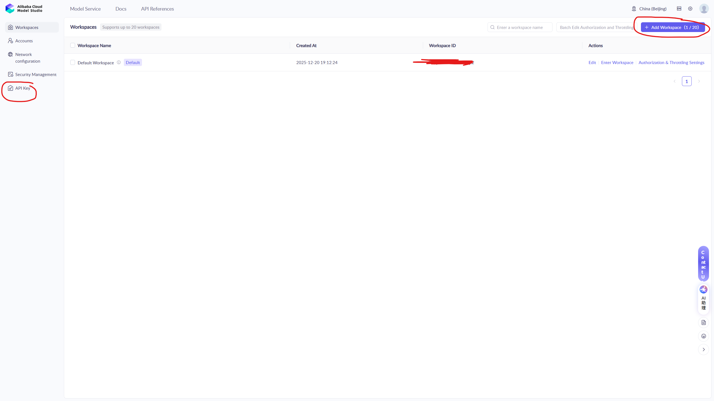

5. **Create API Key** をクリックします。
   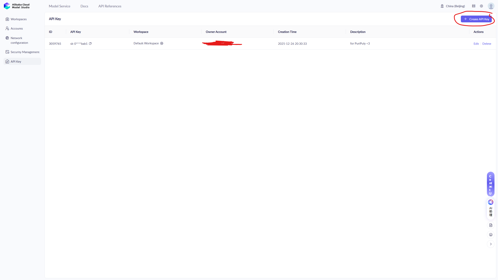

6. アカウントとワークスペースを割り当てて、OKボタンを押します。
   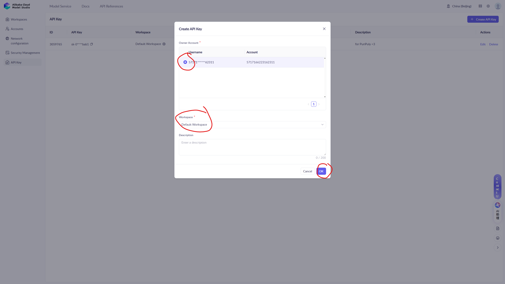

7. 丸で囲まれた部分を押してキーをコピーします。
   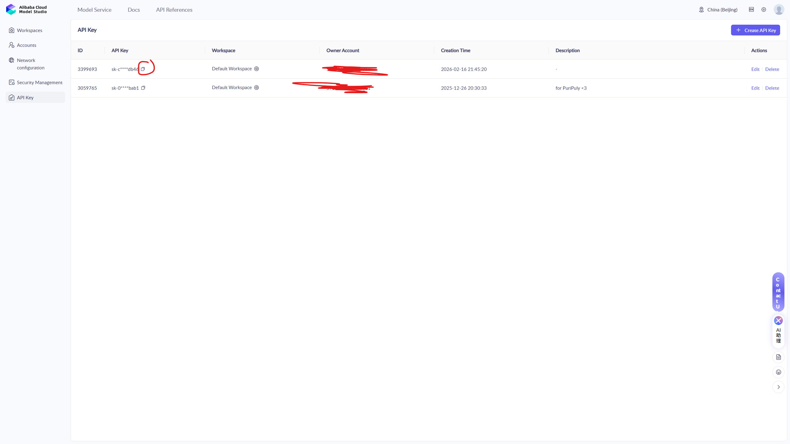

</details>

<details>
<summary><h3>Soniox</h3></summary>

1. [Soniox Console](https://console.soniox.com/)にログインします。
   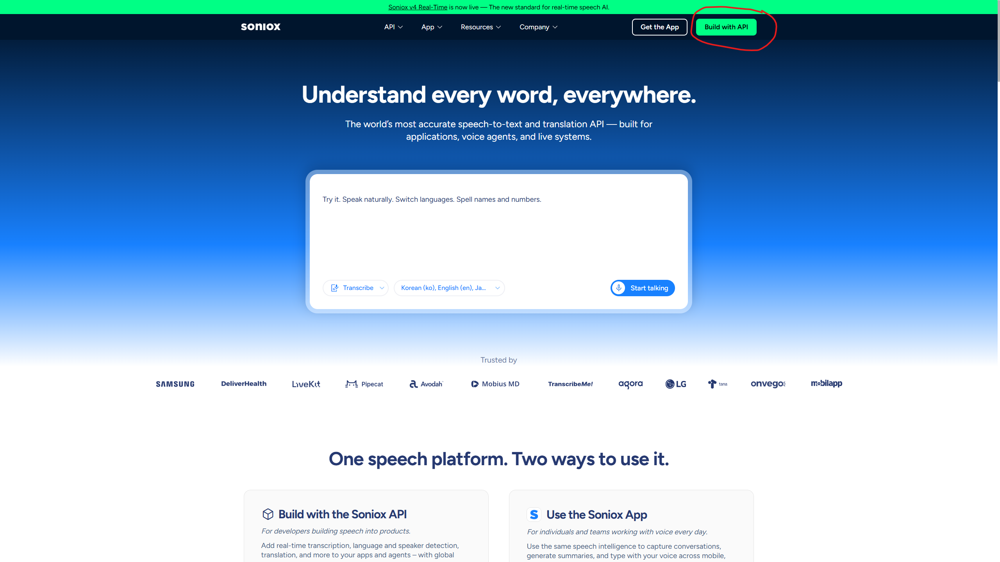

2. 組織の名前を任意で入力します。
   

3. **Add Funds** ボタンを押し、支払い方法を登録します。
   

4. Sonioxはプリペイド方式のチャージが必要です。チャージ完了後、**API Keys** メニューへ移動します。
   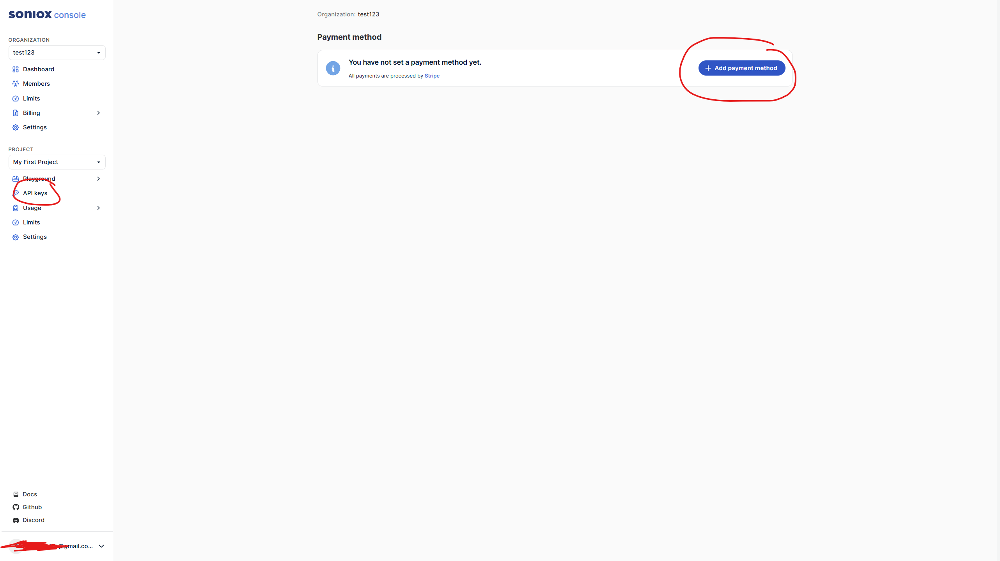

5. 新しいAPI Keyを作成します。
   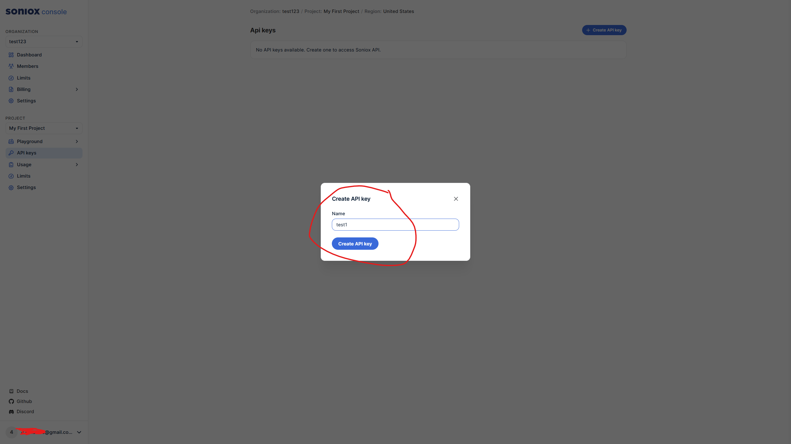

6. 作成されたキーをコピーして、PuriPulyの設定に貼り付けます。
   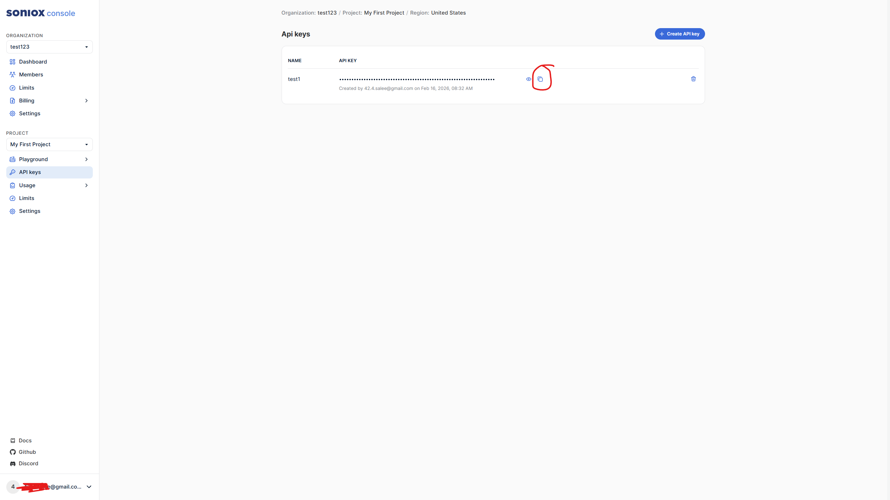

</details>


---

## Q&A

- **音声認識がうまくいきません**
→ 代わりとしてSonioxを試してみてください。特に韓国語ユーザーに推奨しています。また、中国語ユーザーには Qwen ASR を推奨しています。

- **翻訳の口調が気に入りません**
→ Settings → Prompt Editor で、好みの口調を直接指定できます。

- **高速応答モードでは何が変わりますか？**
→ 発話が終わる前に翻訳を開始することで、遅延を減らします。安定モードに切り替えると、若干コストを節約できます。

- **音声認識のスペースや句読点がおかしくなります**
→ 問題ありません。LLMはこういったノイズに強く、翻訳にはほとんど影響しません。

- **Geminiの有料サブスクリプションを契約しているのですが、APIキーの代わりに使えますか？**
→ いいえ。GeminiのサブスクリプションとAPIは別物です。

- **音声認識されたテキストは出ますが、翻訳は出ません**
→ Gemini APIを有料プランに切り替えましたか？ 無料枠では1分あたりのリクエスト数が15回に制限されています。リクエストが多いと一時的に制限がかかる可能性があります。有料プランへの切り替えをおすすめします。

---

## 開発

### インストール

```bash
python -m venv .venv
.venv\Scripts\activate  # Windows
```

```bash
# pip
pip install -e '.[dev]'

# または uv
uv sync --dev
```

```bash
pre-commit install
```

### 実行

```bash
# 仮想環境を有効にした後
python -m puripuly_heart.main run-gui

# または uv run で直接実行
uv run python -m puripuly_heart.main run-gui
```

### 開発用コマンド

```bash
black src tests          # フォーマット
ruff check src tests     # リント
python -m pytest         # テスト（仮想環境での実行を推奨）
```

### ビルド

```bash
.venv\Scripts\pyinstaller build.spec   # 実行ファイル作成
ISCC installer.iss                     # インストーラ作成
```
---

## 開発者

[salee](https://github.com/kapitalismho)

---

## コントリビューター

[RICHARDwuxiaofei](https://github.com/RICHARDwuxiaofei)

---

## ライセンス

[MIT](LICENSE)

サードパーティライセンス: `THIRD_PARTY_NOTICES.txt`
