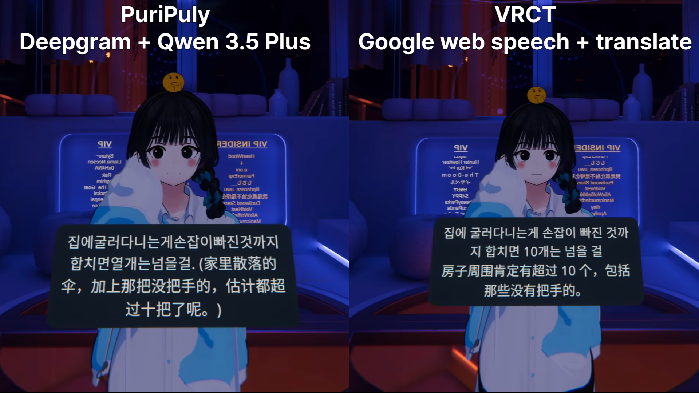

<p align="center">
  
</p>

<h1 align="center">PuriPuly <3</h1>

<p align="center">
  
  
  
  
</p>

<p align="center">LLM-based real-time translator for VRChat</p>

<p align="center">
  <a href="README.md">English</a> | <a href="README.ko.md">한국어</a> | <a href="README.ja.md">日本語</a> | <b>简体中文</b>
</p>

---

## Demo



---

<video src="https://github.com/user-attachments/assets/3709c36d-7b27-4a10-b669-1c79ddb43ae0" controls width="100%"></video>

<video src="https://github.com/user-attachments/assets/86e847dc-0c7d-4eed-8125-9b219b8dde96" controls width="100%"></video>

---

## Finally, talk like real friends.

想安慰对方，
却只说得出一句”你还好吗？”
——对吧。

想传达的心意，
靠”翻译器”是传不到的，你知道的。

所以，我做了这个。

- **基于大语言模型的本地化** — 无论是俚语、口语，还是敬语与平语，都能自然转换
- **记忆上下文** — 结合语境，保持自然流畅的对话节奏
- **粗糙输入也 OK** — 即使空格打错，或者文字被逐个截断，也能完美还原
- **用”我”的语气翻译** — 在提示词编辑器中直接定制风格

### [📥 下载](https://github.com/kapitalismho/PuriPuly-heart/releases/latest)

---

## 使用它需要花钱吗？

阿里云百炼平台为新注册用户提供每个模型 **100 万 Token 的免费额度**，在此期间您可以完全免费使用。

即使免费额度全部用完，每次发言的成本约为 0.004 元（使用推荐组合时），非常便宜。

这款应用使用的是云端 AI 服务。它的计费结构是：用你自己的 API 密钥，用多少就算多少，由服务商直接向你收费。

---

### 推荐组合：Qwen ASR + Qwen 3.5 Plus (快速响应)

| 状态 | 单次说话成本 |
|--------|----------------|
| 使用免费额度 | **0.00** |
| 免费额度耗尽后 | ~$0.0006 (约 0.004 元) |

* 阿里云百炼平台通常会为新开通用户提供一定量（例如各个模型 100 万 Token）的免费额度，具体以官网活动为准。
---

### 每次说话（单次语音）的 API 成本

| 组合 | 原价 | Deepgram 免费额度 | Gemini 免费额度 | 双重免费额度 |
| :--- | :--- | :--- | :--- | :--- |
| **Deepgram + Gemini 3 Flash** | ~$0.0015 (约 0.011 元) | ~$0.0007 (约 0.005 元) | ~$0.0008 (约 0.006 元) | $0.00 |
| **Soniox + Gemini 3 Flash** | ~$0.0013 (约 0.009 元) | - | ~$0.0006 (约 0.004 元) | - |
| **Deepgram + Gemini 3.1 Flash-Lite** | ~$0.0011 (约 0.008 元) | ~$0.0003 (约 0.002 元) | ~$0.0008 (约 0.006 元) | $0.00 |
| **Soniox + Gemini 3.1 Flash-Lite** | ~$0.0005 (约 0.004 元) | - | ~$0.0002 (约 0.001 元) | - |
| **Qwen ASR + Qwen 3.5 Plus** | ~$0.0006 (约 0.004 元) | - | - | $0.00 |
| **Qwen ASR + Qwen 3.5 Flash** | ~$0.0005 (约 0.004 元) | - | - | $0.00 |

*   *Qwen 的 API 计费以北京主节点（Region）为准*
*   *Soniox 按照连接时间计费*
*   *假设（输入 850 Token + 输出 20 Token）× 每次发音平均 LLM 调用次数 1.3 次*
*   *此资费标准截至：2026 年 3 月 2 日 / 开启快速响应模式*
*   *1 美元 ≈ 7.2 元人民币*

---

### 免费额度

| 服务 | 免费额度 | 期限 | 备注 |
|--------|------------|------|------|
| **Deepgram** | $200 | 无限制 | - |
| **Gemini** | $300 | 90天 | 升级至付费方案后发放 |
| **Qwen** | 每个模型 100万 Token | 90天 | - |

---

# 如果您对 API 密钥感到陌生，请参考并按照[使用指南](#api-密钥申请指南)操作

## 使用方法

1. 从[下载页面](https://github.com/kapitalismho/PuriPuly-heart/releases/latest)下载并安装最新版本。
2. 在 [阿里云百炼平台](https://bailian.console.aliyun.com/cn-beijing) 申请 Qwen API 密钥 (建议选择 北京区域 / Beijing Region)。
3. 在 PuriPuly 的 **设置** 标签页中输入 API 密钥并验证。
   - 将 API 密钥粘贴到输入框后，请按回车键或取消聚焦输入框。
4. 确保在设置中选择：
   - STT: **Qwen ASR**
   - LLM: **Qwen 3.5 Plus**
   - Qwen 服务器区域: **Beijing** (如果您在百炼选择了北京)
5. 在 **仪表板** 中选择源语言/目标语言。
6. 点击 **STT** 和 **Trans** 按钮。
7. 在 VRChat 中启用 OSC：Settings → OSC → Enable

* 如果未能识别语音，请在 PuriPuly 的设置标签页中选择正确的麦克风。

---

### 海外用户及可用特殊网络用户的指南

如果您所在地区可以自由访问 Google 和 Deepgram：

1. 在 [Deepgram](https://console.deepgram.com) 申请 Deepgram API 密钥。
2. 在 [Google AI Studio](https://aistudio.google.com/apikey) 申请 Gemini API 密钥。
3. **将 Gemini API 计费方案**升级为付费（强烈推荐）。
   - 免费层级存在严格的请求限制，难以满足日常使用。
4. 在设置中将服务提供商更改为 Deepgram 和 Gemini 并验证密钥。

---

## API 密钥申请指南

<details>
<summary><h3>Deepgram</h3></summary>

1. 访问并登录 [Deepgram Console](https://console.deepgram.com/)。
   

2. 当出现欢迎信息或调查问卷时，请点击 **Skip** 跳过。
   

3. 在服务选择界面中，选择 **STT (Speech-to-Text)**。
   

4. 在 API Keys 菜单中，点击 **Create a New API Key**。
   

5. 输入密钥名称（例如：`puripuly`）并生成。
   

6. 复制生成的密钥并粘贴到 PuriPuly 的网络设置中。
   

</details>

<details>
<summary><h3>Gemini</h3></summary>

1. 访问 [Google AI Studio](https://aistudio.google.com/apikey) 并点击 **Get API key** 按钮。
   

2. 创建一个新项目。
   

3. 随意起一个名字。
   

4. 选择创建好的项目并点击 **Create key**。
   

5. 点击圆圈标记的地方。
   

6. 点击圆圈标记的地方并复制密钥。
   

7. （强烈推荐）点击黄色高亮的 **Set Up Billing** 按钮，升级并切换到付费方案。
   

</details>

<details>
<summary><h3>Qwen</h3></summary>

1. 根据您所在的地区，选择合适的链接访问阿里云百炼平台：
   - [中国大陆](https://bailian.console.aliyun.com/cn-beijing)
   - [中国大陆以外的地区](https://bailian.console.alibabacloud.com)

2. 在访问的地址中登录。请准确选择您希望申请 API 密钥的区域（Region）。（例如：Beijing）
   

3. 点击右上方账号旁边的 **齿轮图标**。
   

4. 创建一个工作空间（Workspace），然后进入 **API-KEY** 页面。
   

5. 点击 **创建 API Key (Create API Key)**。
   

6. 分配账号和工作空间，然后点击 OK 按钮。
   

7. 点击圆圈标记的地方以复制密钥。
   

</details>

<details>
<summary><h3>Soniox</h3></summary>

1. 登录 [Soniox Console](https://console.soniox.com/)。
   

2. 随意填写一个组织名称。
   

3. 点击 **Add Funds** 按钮以绑定支付方式。
   

4. Soniox 需要预先充值余额。充值完成后，请前往 **API Keys** 菜单。
   

5. 创建一个新的 API Key。
   

6. 复制生成的密钥并将其粘贴到 PuriPuly 设置中。
   

</details>


---

## 常见问题解答 (Q&A)

- **从说话到翻译完成需要多长时间？**
→ 使用 Gemini 3 Flash 时，延迟约为2秒出头。但如果服务器不稳定，延迟可能会超出正常范围。在这种情况下，请尝试使用 Qwen 模型作为替代。

- **语音识别效果不好**
→ 您可以尝试使用 Soniox 作为替代方案。尤其推荐给韩语用户。此外，中文用户推荐使用 Qwen ASR。

- **我不喜欢翻译的语气**
→ 您可以在 设定 (Settings) → 提示词编辑器 (Prompt Editor) 中亲自定制您想要的语言风格。

- **快速响应模式有什么不同？**
→ 它会在您说完之前就开始翻译，从而显著降低延迟时间。如果切换回稳定模式，您可以节省一些费用。

- **语音识别出的文字里面，标点符号或空格有点奇怪**
→ 没关系。大语言模型 (LLM) 处理这种噪音的能力很强，几乎不会对最终翻译产生影响。

- **我是 Gemini 付费订阅用户，可以用我的订阅代替 API 密钥吗？**
→ 不行。Gemini 网页版订阅和 API 计费是两回事，互相独立。

- **有语音识别出的文字，但是没有翻译结果 (使用 Gemini API 时)**
→ 您是否已经将 Gemini API 升级成付费方案了？免费的层级限制每分钟只能请求 15 次。如果请求过于频繁，您有可能会被暂时封禁。因此强烈推荐您使用付费方案。

---

## 开发

### 安装

```bash
python -m venv .venv
.venv\Scripts\activate  # Windows
```

```bash
# pip
pip install -e '.[dev]'

# 或者 uv
uv sync --dev
```

```bash
pre-commit install
```

### 运行

```bash
# 激活虚拟环境后
python -m puripuly_heart.main run-gui

# 或者直接使用 uv run 执行
uv run python -m puripuly_heart.main run-gui
```

### 开发指令

```bash
black src tests          # 格式化代码
ruff check src tests     # 代码检查
python -m pytest         # 运行测试 (建议在虚拟环境中执行)
```

### 打包构建

```bash
.venv\Scripts\pyinstaller build.spec   # 生成执行文件
ISCC installer.iss       # 制作安装包
```
---

## 开发者

[salee](https://github.com/kapitalismho)

---

## 贡献者

[RICHARDwuxiaofei](https://github.com/RICHARDwuxiaofei)

---

## 开源协议

[MIT](LICENSE)

第三方软件开源协议说明: `THIRD_PARTY_NOTICES.txt`
