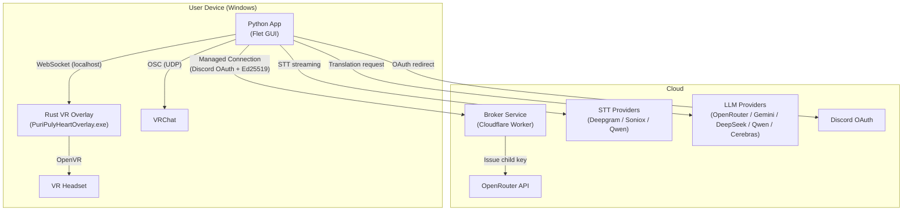
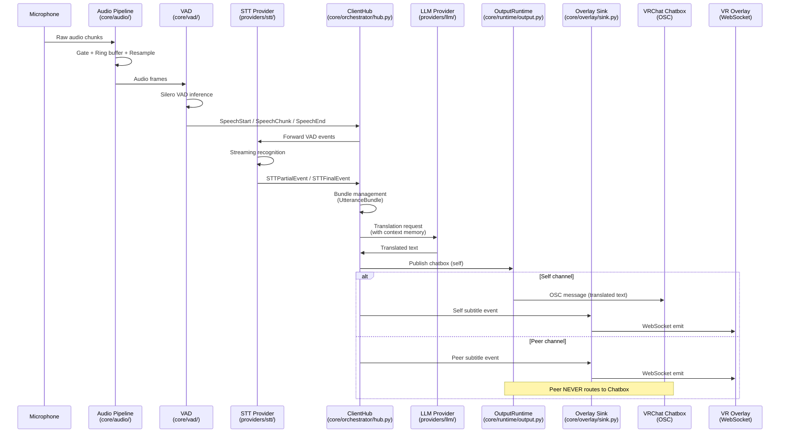
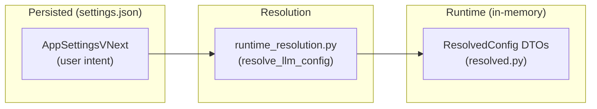
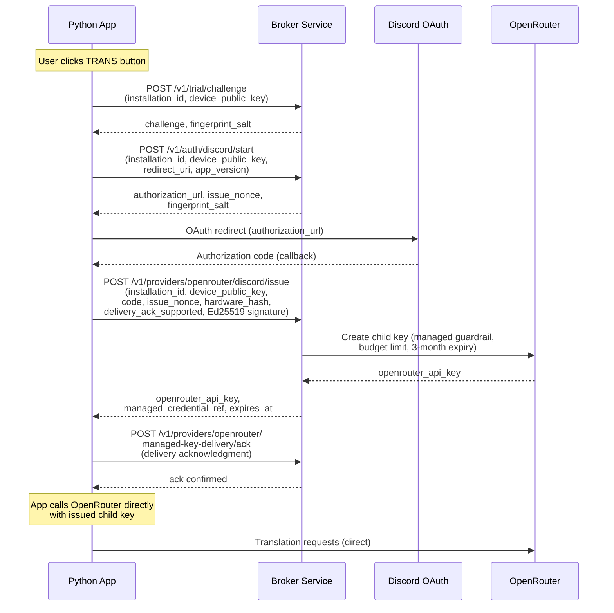
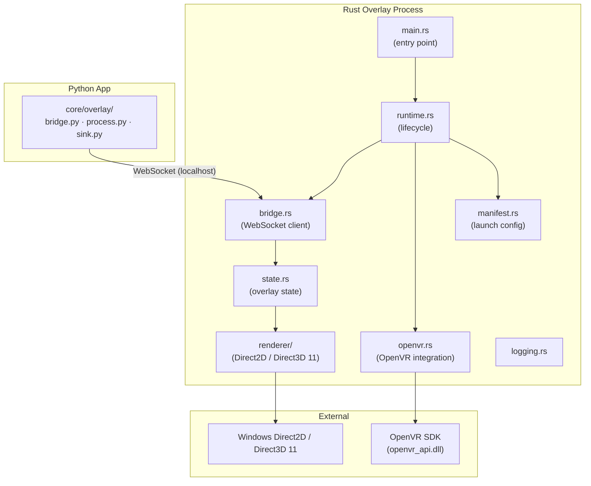
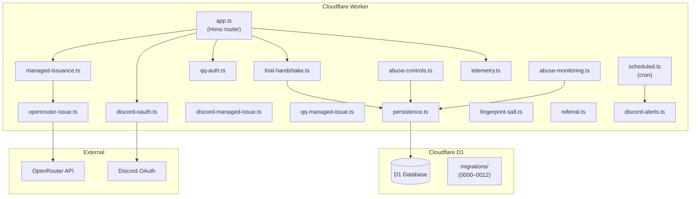

# PuriPuly Architecture

---

## 1. Overview

PuriPuly is an LLM-based two-way real-time voice translator for VRChat. It captures spoken audio, recognizes speech (STT), translates it via an LLM, and routes the result to VRChat chatbox, VR subtitle overlay, or desktop overlay.

The system consists of three independently built components:

| Component | Tech Stack | Location | Purpose |
|---|---|---|---|
| **Python App** | Python 3.12, Flet, asyncio | `src/puripuly_heart/` | Main application: audio capture, STT, LLM translation, UI, output routing |
| **Rust VR Overlay** | Rust, OpenVR, Direct2D | `native/overlay/` | In-VR headset subtitle rendering via WebSocket |
| **Broker Service** | TypeScript, Hono, Cloudflare Workers, D1 | `broker/` | Managed Connection eligibility, credential issuance, abuse control |

### System-level Architecture



### Key design principle

The Broker is **not** a translation proxy. After the Broker issues an OpenRouter child key, the app calls OpenRouter (and STT/LLM providers) directly. The Broker only handles eligibility verification, credential issuance, and abuse control.

---

## 2. Python App Architecture

The Python app follows a **Ports & Adapters (Hexagonal)** architecture with clear layer separation. The intended dependency direction is inward (outer layers depend on inner layers), though in practice `domain/events.py` imports `core/messages.py` for shared message types.

### 2.1 Layered Structure

```mermaid
graph TB
    subgraph "Presentation"
        UI["ui/<br/>(Flet GUI, Controller, Views, i18n)"]
    end

    subgraph "Application (Composition Root)"
        App["app/<br/>ports · services · adapters · wiring"]
    end

    subgraph "Core Runtime"
        Core["core/<br/>orchestrator · audio · vad · stt · llm<br/>osc · overlay · output · runtime"]
    end

    subgraph "Domain"
        Domain["domain/<br/>models · events"]
    end

    subgraph "Configuration"
        Config["config/<br/>settings_vnext · runtime_resolution<br/>prompts · resolved"]
    end

    subgraph "Provider Implementations"
        Providers["providers/<br/>stt/ · llm/"]
    end

    UI --> App
    App --> Core
    App --> Config
    App --> Providers
    Core --> Domain
    Core --> Config
    Domain --> Core
    Providers --> Core
    Providers --> Config
```

### 2.2 Directory Structure

```
src/puripuly_heart/
├── main.py                  # CLI entry point (run-gui, run-desktop-overlay, ...)
├── domain/                  # Domain models & events
│   ├── models.py            # Transcript, Translation, OSCMessage, UtteranceBundle, ChannelId
│   └── events.py            # STT events, UI events, STTSessionState (imports core/messages)
├── app/                     # Composition root: ports, services, adapters, wiring
│   ├── ports/               # Interface definitions (Protocol classes)
│   │   ├── secret_store.py
│   │   ├── settings_repository.py
│   │   ├── broker_client.py
│   │   ├── discord_auth.py
│   │   ├── managed_identity.py
│   │   ├── provider_verifier.py
│   │   └── runtime_apply.py
│   ├── services/            # Business logic (use cases)
│   │   ├── settings_mutation.py
│   │   ├── managed_connection_auth.py
│   │   ├── secret_settings_transaction.py
│   │   ├── provider_runtime_apply.py
│   │   ├── managed_key_delivery_ack.py
│   │   └── qq_managed_auth.py
│   ├── adapters/            # External system adapters
│   │   └── provider_verifier.py
│   └── wiring_*.py          # Dependency assembly factories
│       ├── wiring.py              # Re-exports all wiring factories
│       ├── wiring_llm_factory.py  # LLM provider creation
│       ├── wiring_stt_factory.py  # STT backend creation
│       ├── wiring_overlay_factory.py
│       ├── wiring_secrets_factory.py
│       ├── wiring_managed_auth_factory.py
│       └── wiring_composition.py
├── core/                    # Core runtime engine
│   ├── orchestrator/        # Central coordination
│   │   ├── hub.py           # ClientHub — the main orchestrator
│   │   ├── channel_runtime.py # Per-channel state machine
│   │   ├── context.py       # Context memory resolver
│   │   └── ports.py         # Hub port protocols (chatbox, overlay, logging)
│   ├── audio/               # Audio capture pipeline
│   │   ├── desktop_pipeline.py
│   │   ├── desktop_source.py
│   │   ├── gate.py          # Audio gate (silence detection)
│   │   ├── ring_buffer.py
│   │   └── streaming_resampler.py
│   ├── vad/                 # Voice Activity Detection
│   │   ├── silero.py        # Silero VAD model
│   │   ├── gating.py        # SpeechStart, SpeechChunk, SpeechEnd events
│   │   ├── bundled.py
│   │   └── sink.py
│   ├── stt/                 # STT controller & backend abstraction
│   │   ├── controller.py
│   │   ├── backend.py
│   │   └── custom_vocab.py
│   ├── llm/                 # LLM provider interface
│   │   ├── provider.py      # LLMProvider protocol
│   │   └── fallback_racing.py
│   ├── osc/                 # VRChat OSC communication
│   │   ├── sender.py        # Chatbox OSC sender
│   │   ├── receiver.py
│   │   ├── udp_sender.py
│   │   ├── chatbox_paginator.py
│   │   └── encoding.py
│   ├── overlay/             # VR overlay communication
│   │   ├── bridge.py        # WebSocket bridge to Rust overlay
│   │   ├── process.py       # Overlay process lifecycle
│   │   ├── protocol.py      # Overlay message protocol
│   │   ├── sink.py          # Overlay output sink
│   │   ├── presenter.py
│   │   ├── manifest.py
│   │   └── state.py
│   ├── output/              # Output routing layer
│   │   ├── router.py        # OutputRouter — multi-destination routing
│   │   ├── chatbox.py       # Self chatbox output port
│   │   ├── subtitle.py      # Subtitle overlay output port
│   │   └── models.py        # Output routes, publication kinds, decisions
│   ├── runtime/             # Runtime lifecycle management
│   │   ├── audio_vad_loop.py # Audio → VAD → STT event loop
│   │   ├── self_audio.py    # Self channel runtime
│   │   ├── peer_channel.py  # Peer channel runtime
│   │   ├── output.py        # OutputRuntime
│   │   ├── overlay.py
│   │   ├── provider_handle.py   # ProviderRuntimeHandle (hot-swap)
│   │   ├── provider_rebuild.py
│   │   └── logging.py
│   ├── managed_*.py         # Managed Connection (Discord/QQ → Broker → OpenRouter)
│   ├── discord_*.py         # Discord OAuth flow
│   ├── storage/             # Persistence layer
│   ├── clock.py             # Monotonic clock abstraction
│   ├── lifecycle.py         # App lifecycle management
│   ├── telemetry.py
│   ├── observability.py
│   ├── messages.py          # UserMessageRef, ErrorDiagnostics (safe message references)
│   ├── error_messages.py
│   └── runtime_logging.py
├── config/                  # Configuration system
│   ├── settings.py          # Legacy settings (compatibility)
│   ├── settings_vnext/      # Next-gen settings
│   │   ├── schema.py        # AppSettingsVNext dataclass
│   │   ├── facade.py        # Load/save facade
│   │   ├── serialization.py
│   │   ├── migration.py
│   │   └── compat.py
│   ├── runtime_resolution.py # Resolve settings → runtime config
│   ├── resolved.py          # Resolved runtime config DTOs
│   ├── prompts.py           # Translation prompt templates
│   ├── paths.py             # Default config/data paths
│   ├── vad_defaults.py
│   ├── audio_host_api.py
│   └── llm_profiles.py
├── providers/               # External service implementations
│   ├── stt/
│   │   ├── deepgram.py
│   │   ├── soniox.py
│   │   ├── qwen_asr.py
│   │   └── local_qwen_sherpa.py
│   └── llm/
│       ├── openrouter.py
│       ├── gemini.py
│       ├── deepseek.py
│       ├── qwen.py
│       ├── qwen_async.py
│       ├── cerebras.py
│       └── local_openai.py
├── ui/                      # Flet-based UI
│   ├── app.py               # main_gui entry
│   ├── controller.py        # UI controller (settings, hub lifecycle, events)
│   ├── desktop_overlay.py   # Desktop subtitle overlay renderer
│   ├── views/               # UI views
│   ├── components/          # UI components
│   ├── event_bridge.py      # UIEventBridge
│   ├── event_dispatch.py    # Event destinations
│   ├── event_mapping.py
│   ├── event_projection.py
│   ├── i18n.py              # Internationalization
│   ├── theme.py
│   └── fonts.py
└── data/                    # Bundled data (icons, fonts, licenses, prompts)
```

### 2.3 Ports & Adapters Pattern

The app uses `typing.Protocol` to define ports (interfaces). Implementations are wired in `app/wiring_*.py` factories at startup.

```
app/ports/          ← Protocol definitions (interfaces)
app/services/       ← Business logic that depends on ports
app/adapters/       ← Concrete adapter implementations
app/wiring_*.py     ← Factory functions that create adapters and inject ports
```

Key ports:

| Port | Purpose |
|---|---|
| `SecretStore` | Secret access (keyring / encrypted file) |
| `SettingsRepository` | Settings load / commit (snapshots, transactions) |
| `BrokerClient` | Broker API client (challenge, verify, issue) |
| `DiscordAuth` | Discord OAuth flow |
| `ManagedIdentity` | Managed identity state |
| `ProviderVerifier` | Provider credential verification |
| `RuntimeApply` | Runtime config application (hot-swap providers) |

The orchestrator also defines its own ports in `core/orchestrator/ports.py`:

| Port | Purpose |
|---|---|
| `HubChatboxPort` | Chatbox enqueue, typing, flush |
| `HubOverlaySinkPort` | Overlay event emission |
| `HubOverlayEventFactoryPort` | Overlay event construction |
| `HubRuntimeLoggingPort` | Basic/detailed logging |

---

## 3. Core Data Flow

The central processing pipeline transforms spoken audio into translated text output.

### 3.1 End-to-End Pipeline



### 3.2 Channel Model

PuriPuly distinguishes two conversation channels:

| Channel | Source | Output Destinations | Chatbox? |
|---|---|---|---|
| **self** | User's own microphone | VRChat Chatbox (OSC) + VR/Desktop Subtitle Overlay | Yes |
| **peer** | Other participant's voice (when peer translation enabled) | VR/Desktop Subtitle Overlay only | **Never** |

### 3.3 VAD Event Flow

The `ClientHub` receives VAD events and coordinates the pipeline:

1. **`SpeechStart`** — VAD detected speech onset. In low-latency mode, marks resume pending.
2. **`SpeechChunk`** — Audio chunk during active speech. Forwarded to STT provider.
3. **`SpeechEnd`** — Speech ended. Records `speech_end` timestamp for E2E latency tracking. Triggers STT finalization.

The hub forwards all VAD events to the STT provider via `handle_vad_event()`. The STT provider emits `STTPartialEvent` and `STTFinalEvent` back through its `events()` async iterator.

### 3.4 Latency Tracking

The hub records timestamps at each pipeline stage for E2E latency measurement:

```
speech_end → stt_final → llm_request_start → llm_done
           → self_chatbox_enqueue / peer_overlay_first_emit / peer_overlay_first_render
```

Latency is reported in two modes:
- **Basic**: `[Basic][Latency] channel=self e2e_ms=1234`
- **Detailed**: Stage-by-stage breakdown + dominant cause metric

---

## 4. Orchestrator Hub

`ClientHub` (`core/orchestrator/hub.py`) is the central orchestrator. It owns:

- **Two `ChannelRuntime` instances** (`self_runtime`, `peer_runtime`) — each manages per-channel utterance bundles, translation tasks, context history, and merge buffers.
- **Three `ProviderRuntimeHandle` instances** (`self_stt`, `peer_stt`, `llm`) — hot-swappable provider handles with lifecycle management (start, stop, replace, drain).
- **`OutputRuntime`** — wraps the chatbox port and overlay event adapter.
- **`ContextResolver`** — resolves context memory entries for LLM prompts (local mode and integrated mode).

### 4.1 Key Hub Responsibilities

| Responsibility | Method |
|---|---|
| Receive VAD events | `handle_vad_event()`, `handle_peer_vad_event()` |
| Process STT events | `_handle_stt_event()` (partial, final, error, session state) |
| Trigger translation | `_ensure_translation()` |
| Manage utterance lifecycle | `get_or_create_bundle()`, UtteranceBundle tracking |
| Hot-swap providers | `replace_stt_provider()`, `replace_peer_stt_provider()`, `replace_llm_provider()` |
| Lifecycle management | `start()`, `stop()` |
| Context memory | `_get_valid_context()`, `_remember_context_entry()` |
| Latency tracking | `_record_latency_stage()`, `_emit_latency_summary_if_ready()` |

### 4.2 Provider Hot-Swap

`ProviderRuntimeHandle` (`core/runtime/provider_handle.py`) enables live provider replacement without restarting the hub.

**STT replacement** (`replace_stt_provider()`, `replace_peer_stt_provider()`):
1. Stops ingress (cancels the event loop task).
2. Resets channel runtime state (utterances, translation tasks, merge buffers).
3. Replaces the provider reference.
4. Restarts the event loop if the hub is running.

**LLM replacement** (`replace_llm_provider()`):
1. Replaces the provider reference via `ProviderRuntimeHandle.replace_provider(llm, start=False)`.
2. Does not reset channel runtime state or restart an event loop (LLM has no event loop).

### 4.3 Context Memory

The `ContextResolver` supports two modes:

- **Local mode** — Includes recent entries from the same channel (self or peer independently).
- **Integrated mode** — Includes recent entries from both channels for cross-channel context awareness.

Configuration:
- `context_time_window_s` (default: 30s) — Time window for local context.
- `context_max_entries` (default: 3) — Max entries for local context.
- `integrated_context_time_window_s` (default: 40s) — Time window for integrated context.
- `integrated_context_max_entries` (default: 4) — Max entries for integrated context.

---

## 5. Output Routing

`OutputRuntime` (`core/runtime/output.py`) is the active output dispatcher owned by `ClientHub`. It wraps the chatbox port and the overlay event adapter, and records `OutputRoutingDecision` entries for every publish attempt.

`OutputRouter` (`core/output/router.py`) defines the routing model (routes, publication kinds, decision statuses) used by `OutputRuntime` and the output ports.

### 5.1 Output Routes

| Route | Destination | Used By |
|---|---|---|
| `OUTPUT_ROUTE_SELF_CHATBOX` | VRChat Chatbox (OSC) | Self utterances |
| `OUTPUT_ROUTE_SUBTITLE_OVERLAY` | VR/Desktop Subtitle Overlay | Self + Peer utterances |
| `OUTPUT_ROUTE_DASHBOARD` | UI Dashboard | System disclosures |
| `OUTPUT_ROUTE_SYSTEM_DISCLOSURE_CHATBOX` | VRChat Chatbox (OSC) | System disclosures |
| `OUTPUT_ROUTE_CONVERSATION_FEED` | UI Conversation feed | Self utterances |

### 5.2 Routing Decisions

Each publish call returns `OutputRoutingDecision` with status:

- **`PUBLISHED`** — Successfully published to the destination.
- **`SKIPPED`** — Destination unconfigured or publish failed (with reason).
- **`DENIED`** — Explicitly denied (e.g., peer chatbox attempt).

### 5.3 Peer Chatbox Hard Deny

`OutputRuntime` enforces the peer-chatbox hard deny rule: peer-channel utterances are never published to the self chatbox route. When a peer utterance would have routed to the chatbox, a `DENIED` decision is recorded with reason `peer_chatbox_denied`.

---

## 6. Configuration System

### 6.1 Settings Layers

PuriPuly separates persisted user intent from resolved runtime config:



- **`AppSettingsVNext`** (`config/settings_vnext/schema.py`) — User-facing settings dataclass. Persisted to `settings.json`. Includes intent for translation, STT, UI, secrets, overlay, and OSC.
- **`runtime_resolution.py`** — Transforms user intent into resolved runtime DTOs (e.g., `resolve_llm_config()` resolves the concrete provider, model, and credential source/reference based on connection type). Actual secret lookup happens later through `SecretStore`.
- **`resolved.py`** — Resolved runtime configuration DTOs used by wiring factories.

### 6.2 Settings Compatibility

- `settings_vnext/compat.py` — Backward compatibility with legacy settings.
- `settings_vnext/migration.py` — Forward migration from legacy to vNext.
- `profile_bootstrap.py` — Imports stable settings into vNext on first run.
- `to_dict` / `from_dict` must stay synchronized. New settings have defaults so existing `settings.json` continues loading.
- Renamed keys are accepted in `from_dict` for backward compatibility.

### 6.3 Secret Store

Secrets (API keys) are managed through `SecretStore` (`app/ports/secret_store.py`):

- **keyring** — OS keyring backend (default).
- **encrypted_file** — Encrypted file backend (requires `PURIPULY_HEART_SECRETS_PASSPHRASE`).

Individual secret lookups fall back to environment variables when the configured backend has no value, but `env` is not a selectable `secrets.backend` value.

`wiring_secrets_factory.py` creates the appropriate store based on `secrets.backend` setting.

---

## 7. Managed Connection Flow

Managed Connection allows eligible users to use translation without bringing their own API key. The flow involves Discord OAuth, the Broker, and OpenRouter.



### 7.1 Key Design Points

- **Broker is not a proxy** — After issuance, the app calls OpenRouter directly.
- **Ed25519 device signing** — Each installation has a device key pair. Requests are signed to prevent credential theft.
- **Hardware fingerprint** — `hardware_hash` with server-managed salt for duplicate detection.
- **QQ alternative** — Users in China can authenticate via QQ instead of Discord (`POST /v1/auth/qq/assert`).
- **Talk Together Pass ID** — Shareable pass identifier for extra managed usage with a friend.

### 7.2 App-Side Components

| Module | Purpose |
|---|---|
| `core/hardware_fingerprint.py` | Generate hardware fingerprint |
| `core/managed_identity.py` | Managed identity state |
| `core/managed_openrouter_broker_client.py` | Broker API client |
| `core/managed_openrouter_release.py` | Release token lifecycle |
| `core/openrouter_credentials.py` | Managed credential storage & user identifier |
| `core/discord_managed_oauth.py` | Discord OAuth flow |
| `core/discord_oauth_loopback.py` | Loopback OAuth server |
| `core/openrouter_pkce.py` | PKCE flow |
| `core/openrouter_handoff.py` | OpenRouter credential handoff |
| `app/services/managed_connection_auth.py` | Auth orchestration service |
| `app/services/managed_key_delivery_ack.py` | Delivery acknowledgment |

---

## 8. Rust VR Overlay

The VR subtitle overlay (`native/overlay/`) is a standalone Rust binary that renders subtitles inside the VR headset.

### 8.1 Architecture



### 8.2 Communication Protocol

The Python app hosts a localhost WebSocket server, launches the overlay process, and the Rust overlay connects as a client:

1. **`core/overlay/bridge.py`** — Starts a localhost WebSocket server (`websockets.serve`) and writes the bound port into the launch manifest.
2. **`core/overlay/process.py`** — Spawns `PuriPulyHeartOverlay.exe` with a launch manifest path.
3. **`native/overlay/src/manifest.rs`** — Reads the launch manifest (WebSocket URL, session token, overlay config).
4. **`native/overlay/src/bridge.rs`** — Connects to the Python WebSocket server (`connect_async`) and authenticates with the session token.
5. **`core/overlay/protocol.py`** — Defines the message protocol (transcript, translation, active update, utterance closed).
6. **`core/overlay/sink.py`** — `HubOverlaySinkPort` implementation that emits overlay events through the bridge.

### 8.3 Startup Contract

The overlay binary supports `--check-startup-contract` to verify it can start correctly before the app relies on it. This is a compatibility surface that must be preserved.

### 8.4 Dependencies

| Dependency | Purpose |
|---|---|
| `tokio` | Async runtime |
| `tokio-tungstenite` | WebSocket client |
| `openvr_sys` | OpenVR FFI bindings (Windows only) |
| `windows` | Direct2D / Direct3D 11 rendering |
| `windows-numerics` | Numerical types for rendering |
| `serde` / `serde_json` | Serialization |

---

## 9. Broker Service

The Broker (`broker/`) is a Cloudflare Workers service that manages Managed Connection eligibility and credential issuance.

### 9.1 Architecture



### 9.2 API Endpoints

| Endpoint | Purpose |
|---|---|
| `GET /healthz` | Health check |
| `GET /v1/foundation` | Service foundation info |
| `POST /v1/trial/challenge` | Issue challenge for installation |
| `POST /v1/trial/challenge/verify` | Verify Ed25519-signed challenge |
| `GET /v1/trial/status` | Check managed state and entitlement |
| `POST /v1/auth/discord/start` | Start Discord OAuth managed onboarding |
| `POST /v1/auth/qq/assert` | QQ authentication assertion |
| `POST /v1/telemetry/translation-success-day` | Active-day telemetry |
| `POST /v1/providers/openrouter/issue` | Issue OpenRouter child key (release-token path) |
| `POST /v1/providers/openrouter/discord/issue` | Issue OpenRouter child key (Discord-managed path) |
| `POST /v1/providers/openrouter/managed-key-delivery/ack` | Managed key delivery acknowledgment |

### 9.3 Key Design Points

- **Ed25519 signatures** — All issuance requests are signed with the device private key.
- **Hardware fingerprint** — Server-managed salt with versioned rotation for duplicate detection.
- **Rate limiting** — Per-endpoint, per-IP, per-installation rate limits stored in `broker_request_events`.
- **Abuse controls** — Configurable thresholds in `broker_config`, persisted runtime state in `abuse_runtime_state`.
- **OpenRouter child keys** — Per-installation keys with managed guardrails (model allowlist, budget limit, 3-month expiry).
- **D1 migrations** — Forward-only SQL migrations (`0000` through `0012`).

### 9.4 Verification

Broker verification is Linux-only. Run from WSL or a Linux-native workspace:

```bash
pnpm install --frozen-lockfile
pnpm run typecheck
pnpm exec vitest run
pnpm --filter @puripuly-heart/broker run verify:config
```

---

## 10. Domain Model Summary

Core domain types defined in `domain/models.py` and `domain/events.py`:

### 10.1 Models

| Model | Description |
|---|---|
| `ChannelId` | `"self"` or `"peer"` |
| `Transcript` | Recognized text from speech (partial or final) |
| `Translation` | Localized text from a transcript |
| `OSCMessage` | Message destined for VRChat OSC |
| `UtteranceBundle` | Aggregates partial, final, and translation for one utterance ID |

### 10.2 Events

| Event | Description |
|---|---|
| `STTPartialEvent` | Partial transcript (not yet final) |
| `STTFinalEvent` | Final transcript |
| `STTErrorEvent` | STT error (with optional `UserMessageRef`) |
| `STTSessionStateEvent` | STT session state (CONNECTING, STREAMING, DRAINING, DISCONNECTED) |
| `UIEvent` | Event for UI consumption (transcript, translation, OSC, error, session state) |

### 10.3 Ubiquitous Language

See `CONTEXT.md` for the full ubiquitous language. Key terms:

- **Spoken Turn** — A continuous span of speech from one Channel.
- **Utterance Segment** — A bounded processing unit followed from speech detection through output.
- **Transcript** — Text recognized from speech before translation.
- **Translation** — Localized text produced from a transcript.
- **Channel** — The side of a conversation: self or peer.
- **Translation Connection** — How PuriPuly obtains translation access (managed, user-owned, local).
- **Broker** — PuriPuly-controlled authority for managed eligibility and credential issuance.

---

## 11. Message & Diagnostics Safety

User-facing messages and diagnostics follow a safe-reference pattern:

- **`UserMessageRef`** (`core/messages.py`) — i18n key + parameters, never raw exception text.
- **`UserErrorReport`** — Wraps a `UserMessageRef` with optional `ErrorDiagnostics`.
- **`ErrorDiagnostics`** — Structured diagnostic fields (no raw secrets or payloads).

Core/provider code emits message references and diagnostic facts. UI boundaries localize them via i18n keys.

**Output channels are separate**: self output, peer output, and system output never mix. Peer utterances never route to VRChat chatbox.

---

## 12. Build & Packaging

### 12.1 Python App

```powershell
# Development setup
python -m venv .venv
.venv\Scripts\activate
pip install -e '.[dev]'

# Run GUI
python -m puripuly_heart.main run-gui

# Debug UI preview (hidden UI states)
python -m puripuly_heart.main run-gui --debug-ui-preview

# Tests & linting
black src tests
ruff check src tests
python -m pytest
```

Packaged with PyInstaller (`build.spec`), distributed via Inno Setup installer (`installer.iss`).

### 12.2 Rust VR Overlay

```powershell
cargo test --manifest-path native/overlay/Cargo.toml -q

cargo build `
  --manifest-path native/overlay/Cargo.toml `
  --locked --release `
  --bin PuriPulyHeartOverlay `
  --target-dir target

# Copy to build directory
New-Item -ItemType Directory -Force -Path build/overlay | Out-Null
Copy-Item target/release/PuriPulyHeartOverlay.exe build/overlay/PuriPulyHeartOverlay.exe -Force
Copy-Item third_party/openvr/win64/openvr_api.dll build/overlay/openvr_api.dll -Force

# Verify startup contract
.\build\overlay\PuriPulyHeartOverlay.exe --check-startup-contract
```

### 12.3 Broker Service

```bash
# From Linux/WSL only
pnpm install --frozen-lockfile
pnpm run typecheck
pnpm exec vitest run
pnpm --filter @puripuly-heart/broker run verify:config
pnpm --filter @puripuly-heart/broker run dev
```

---

## 13. Environment Summary

| Area | Recommended Environment |
|---|---|
| Python app development | Windows |
| VR overlay build | Windows |
| Broker service development & verification | Linux / WSL |

### Virtual Environments

- `.venv/` — Windows Python virtual environment (use `.venv\Scripts\activate`).
- `.venv-wsl/` — Linux/WSL Python virtual environment (use `UV_PROJECT_ENVIRONMENT=.venv-wsl`).
- Broker Node dependencies must be installed inside the Linux workspace, not reused from Windows `/mnt/c/...`.
